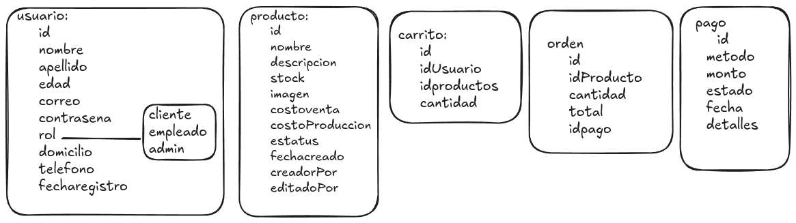
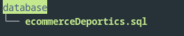
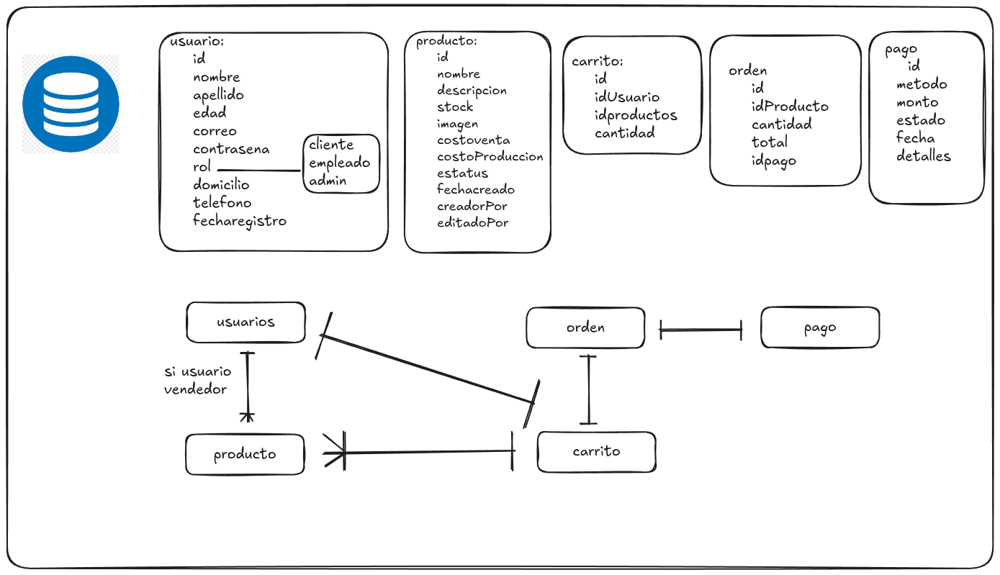

<!DOCTYPE html>
<html >
<body>
    <h1>Sistema ecommerse deportivo</h1>
    
este proyecto surge con el objetivo de crear un sistema ecommerse funcional enfocado a la venta de ropa y de artículos deportivos esto despues de nuestro anterior proyecto el cual era un sistema de análisis y predicción de tiros a penales en base a las estadisticas e historial del jugador al cual podras acceder mediante el siguiente link:  <a href="https://github.com/vicentesilv/sistemaDeportivo.git">https://github.com/vicentesilv/sistemaDeportivo.git</a>
  
    

    <h2>integrantes o colaboradores de este proyecto</h2>
    <ul>
        <li>Vicente Aldahir Silva Lizarraga <a href="https://github.com/vicentesilv">github</a></li>
        <li>Daniel Eduardo Tirado Muñoz <a href="https://github.com/danieltiradom">github</a></li>
        <li>Alberto Brodden Gaeta <a href="https://github.com/broddenga">github</a></li>
        <li>Miguel Albarado Tierney</li>
    </ul>  
    

    <h2>tecnologias a trabaja en el proyecto</h2>
    <ul>
        <li>backend:</li>
            <ul>
                <li>node js</li>
                <ul>
                        <li>@paypal/checkout-server-sdk: para emular pagos con paypal</li>
                        <li>bcrypt: para encriptar contraseñas</li>
                        <li>body-parser: para manejar peticiones http</li>
                        <li>cors: para habilitar cors (Intercambio de recursos de origen cruzado) habilitar comunicacion cliente servidor</li>
                        <li>dotenv: para manejar variables de entorno</li>
                        <li>express: para manejar peticiones http y rutas asi como crear el servidor</li>
                        <li>express-fileupload: para subir archivos y manerjarlos</li>
                        <li>jsonwebtoken: para manejar tokens de acceso</li>
                        <li>multer: para manejar archivos</li>
                        <li>mysql2: para manejar la base de datos</li>
                        <li>nodemailer: para enviar correos</li>
                        <li>nodemon: para reiniciar cambios en el servidor a la hora de desarrollo</li>
                        <li>sharp: para manejar imagenes,tamaños etc</li>
                        <li>stripe: para manejar simulaciones de pago</li>
                </ul>
            </ul>
        <li>frontend:</li>
            <ul>
                <li>angular</li>
                <li>typescript</li>
                <li>bootstrap</li>
            </ul>
        <li>base de datos:</li>
        <ul>
            <li>mariadb</li>
        </ul>
    </ul>
    
ademas de todo lo anterior tambien se usaran herramientas adicionales tales como:  
    <ul>
        <li>xampp: como manejador y alojamiento de la base de datos</li>
        <li>visual studio code: como editor de codigo principal</li>
        <li>git: como manejador de versiones</li>
        <li>postman: como manejador de peticiones http</li>
        <li>npm: como manejador de paquetes</li>
        <li>github: como manejador y alojamiento de repositorios</li>
        <li>excalidraw: para diseño de interfaces,planeacion y diseñador de procesos,diagramas etc</li>
    </ul>
    

    

    <h2>desarrollo de la base de datos</h2>
    <h3>planificacion de la base de datos</h3>
    
    <h3>estructura de la carpeta database</h3>
    
    <h3>planeacion de la base de datos</h3>
    
    
algo mas por mencionar es que ademas de las tablas se crearon 2 vistas para el manejo de la informacion de producto segun el rol del usuario. dicho lo anterior se realizo de la siguiente manera:

    <code>create view productos_cliente as select id,nombre,descripcion,stock,imagen,costoVenta from productos where status = 'activo'; 
    create table productos_empleado as select * from productos;</code>
          
        

        <h2>desarrollo del backend</h2>
</body>
</html>